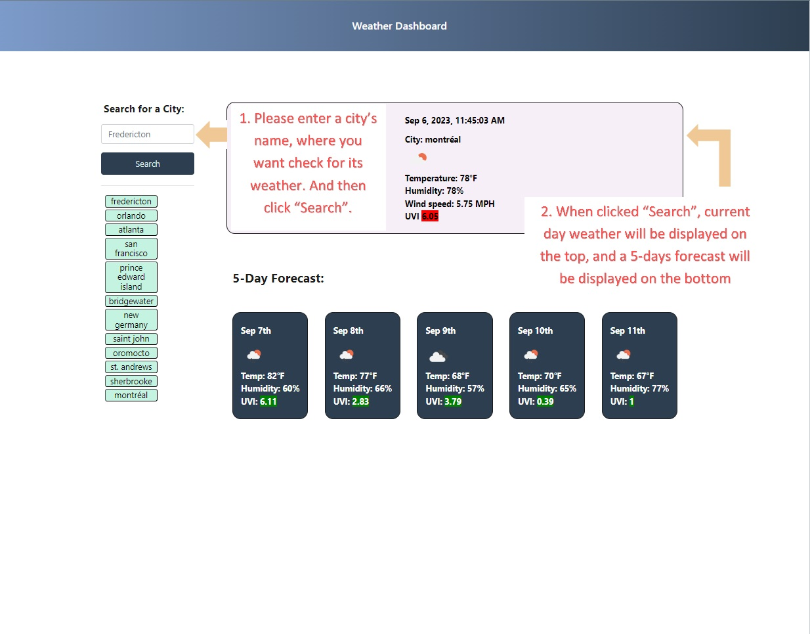
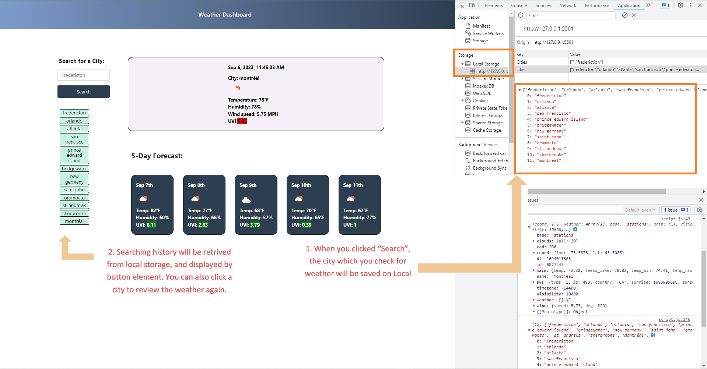

# HuiPan_WeatherDashboard
HuiPan's Weather Dashboard
```
Development Tool: MS VS Code Version:1.81.0;
Third-party Plug-ins: jquery-3.4.1.min.js; dayjs-1.11.3; moment.js-2.29.1; bootstrap-4.3.1;
Third-party API: https://api.openweathermap.org/data/2.5/weather & https://api.openweathermap.org/data/2.5/onecall; 
Weather Condition Icon: https://openweathermap.org/img/wn/
Deployment Platform: GitHub;
```
## User Story
```
AS A traveler
I WANT to see the weather outlook for multiple cities
SO THAT I can plan a trip accordingly
```
## Acceptance Criteria
```
GIVEN a weather dashboard with form inputs
WHEN I search for a city
THEN I am presented with current and future conditions for that city and that city is added to the search history
WHEN I view current weather conditions for that city
THEN I am presented with the city name, the date, an icon representation of weather conditions, the temperature, the humidity, and the the wind speed
WHEN I view future weather conditions for that city
THEN I am presented with a 5-day forecast that displays the date, an icon representation of weather conditions, the temperature, the wind speed, and the humidity
WHEN I click on a city in the search history
THEN I am again presented with current and future conditions for that city
```
## Usage
GitHub folder: https://github.com/HuiPan-Peter/HuiPan_WeatherDashboard/tree/main/Screenshots-User%20Guide
```



```
## Deployment and Pages
- URL Link: https://huipan-peter.github.io/HuiPan_WeatherDashboard/
- Repository Link: https://github.com/HuiPan-Peter/HuiPan_WeatherDashboard
